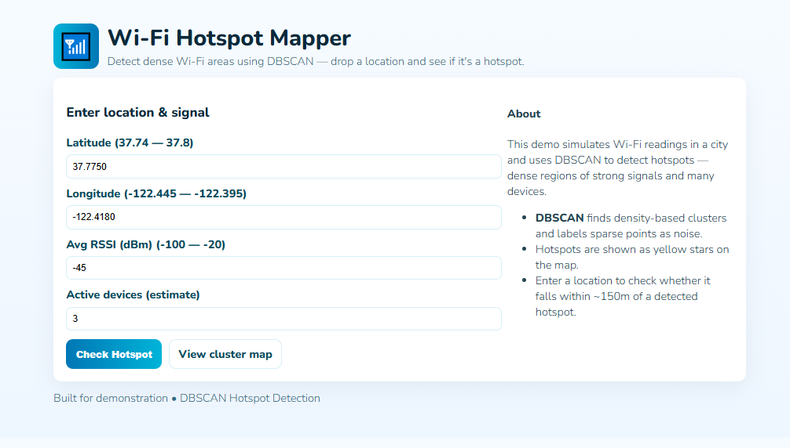
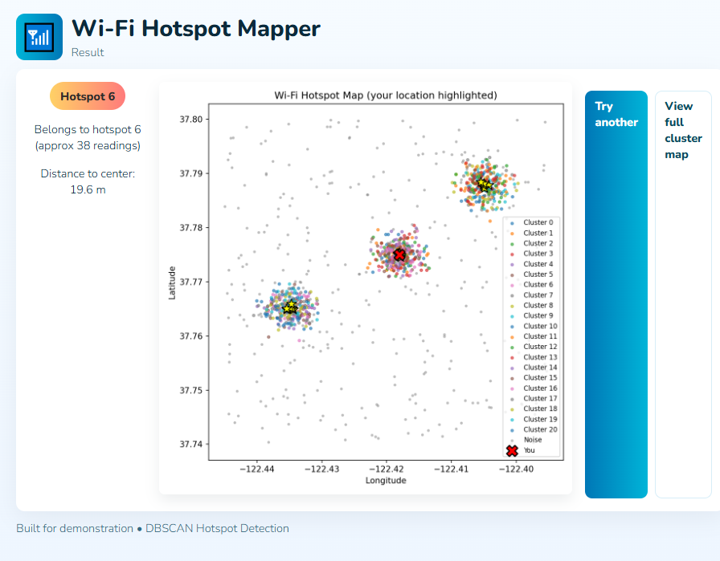

# Wi‑Fi Hotspot Detection using DBSCAN (Flask App)

##  Project Overview
This project detects dense Wi‑Fi hotspots from simulated signal readings using the DBSCAN clustering algorithm.
Users can input a location (latitude, longitude), average RSSI (dBm) and active device estimate to check if that point falls inside a detected hotspot.

##  Project Structure
```
wifi-dbscan/
│
├── app.py
├── train.py
├── data/
│   └── wifi_readings.csv
├── models/
│   ├── scaler.pkl
│   └── cluster_summary.json
├── templates/
│   ├── index.html
│   └── result.html
|
└── README.md
```

##  How It Works

### Data Source
Synthetic Wi‑Fi readings are generated inside a city bounding box. Each reading contains:
- latitude, longitude
- rssi_dbm (signal strength in dBm)
- device_count (number of active devices)

### Model
- Data is scaled and DBSCAN is applied to find dense regions (hotspots).
- Cluster summaries (centers, avg RSSI, avg devices, count) are saved to `models/cluster_summary.json`.
- Points labeled `-1` are considered noise/outliers (not part of any hotspot).

### Deployment
- Flask app (`app.py`) loads cluster summaries and checks a user-provided point by nearest hotspot center (within 150 meters threshold).
- The app returns whether the point is inside a hotspot and produces a small map plot with your point highlighted.

##  Installation

1. Install dependencies
```
pip install -r requirements.txt
```

2. Train (or regenerate) dataset & clusters
```
python train.py
```

3. Run the web app
```
python app.py
```

Open: http://127.0.0.1:5400

##  Sample UI

--------
Step:1

--------
Output page:



Input realistic ranges for the city simulated (latitude and longitude bounds are shown on the form). Example:
- Latitude: 37.7750
- Longitude: -122.4180
- RSSI: -45 dBm
- Active devices: 3

Output: Either "Hotspot X" (with distance) or "Noise / No Hotspot", plus a small map plot showing clusters and your location.


